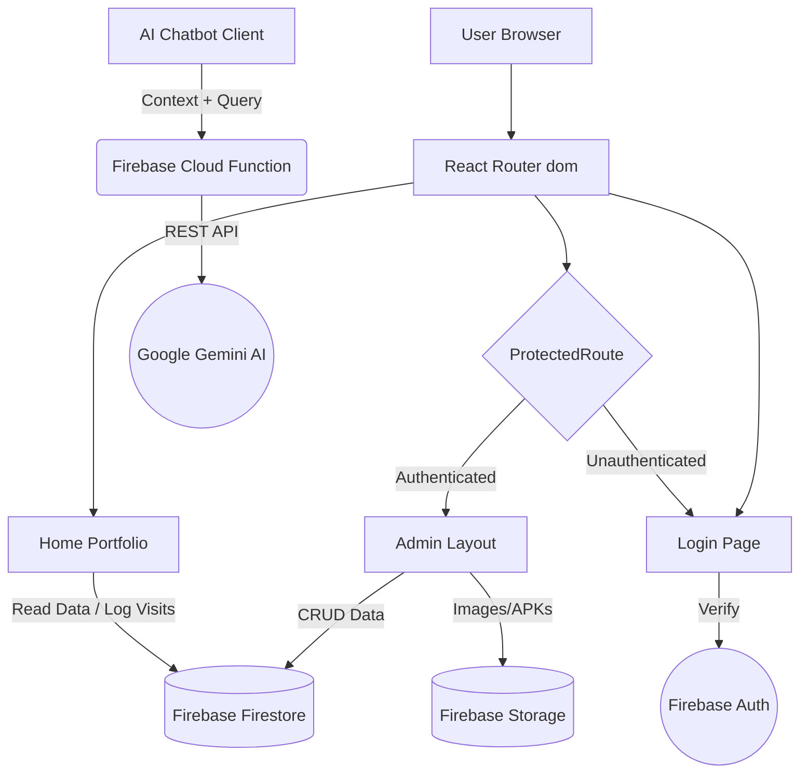
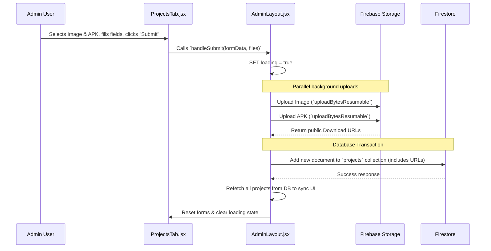
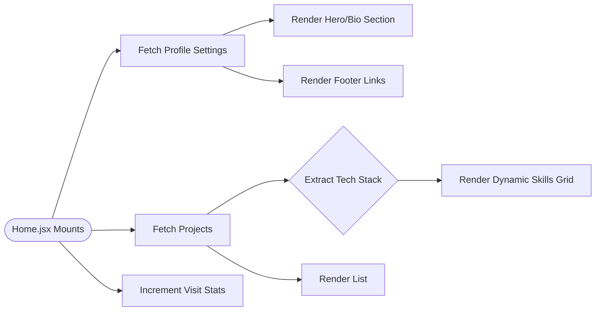
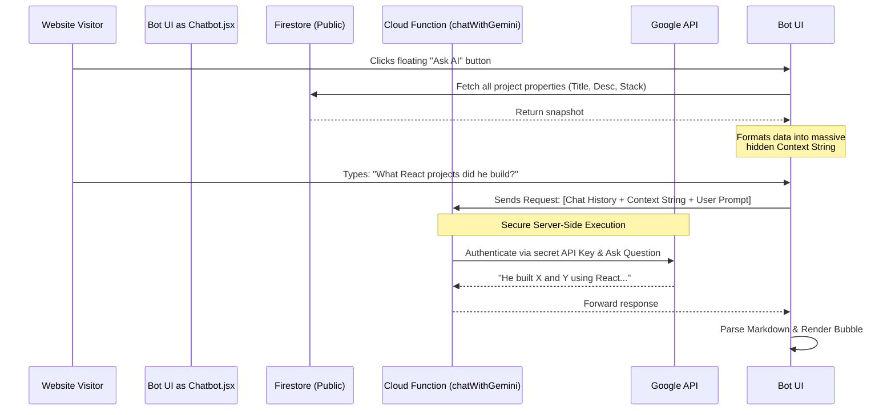

# Complete Project Architecture & Workflow Documentation

This document describes the inner workings of the Portfolio platform. It breaks down the component hierarchy, data flows, background processes, and feature interactions.

---

## 1. Directory Structure

The codebase is organized by domain/feature, meaning each logical part of the application is isolated into its own folder with its specific components and logic.

```text
src/
├── components/
│   └── ui/
│       ├── AnimatedSection.jsx       # Scroll animation wrapper
│       ├── BackToTop.jsx             # Floating back-to-top button
│       ├── ImageLightbox.jsx         # Fullscreen image viewer
│       ├── Navbar.jsx                # Global top navigation
│       ├── ParticleBackground.jsx    # Animated background effects
│       ├── ScrollProgressBar.jsx     # Reading progress indicator
│       ├── SEO.jsx                   # Dynamic document head/meta tags
│       ├── ShareButton.jsx           # Native share API wrapper
│       ├── ThemeToggle.jsx           # Dark/light mode switcher
│       ├── Toast.jsx                 # Notification system
│       └── TypewriterText.jsx        # Typing animation effect
├── features/
│   ├── admin/
│   │   ├── AdminLayout.jsx           # Master admin controller and layout
│   │   └── components/
│   │       ├── AdminSidebar.jsx      # Admin navigation menu
│   │       ├── AiConfigTab.jsx       # Gemini API settings panel
│   │       ├── DashboardTab.jsx      # Analytics and visitor stats panel
│   │       ├── MessagesTab.jsx       # Public contact messages panel
│   │       ├── ProfileTab.jsx        # User resume and bio settings panel
│   │       ├── ProjectsTab.jsx       # Portfolio project CRUD and uploads
│   │       └── SortableProjectItem.jsx # Draggable project list item
│   ├── auth/
│   │   ├── Login.jsx                 # Authentication page
│   │   └── components/
│   │       └── ProtectedRoute.jsx    # Session guarding wrapper
│   ├── chatbot/
│   │   └── Chatbot.jsx               # AI Assistant interface and API bridge
│   └── portfolio/
│       ├── Home.jsx                  # Main public landing page
│       └── components/
│           ├── ProjectCard.jsx       # Individual portfolio project display
│           ├── ResumeModal.jsx       # PDF resume viewer
│           └── SkeletonCard.jsx      # Loading placeholders
├── lib/
│   └── firebase.js                   # Firebase app and service initialization
├── App.jsx                           # Application routing array
├── index.css                         # Global CSS framework and utilities
└── main.jsx                          # React DOM entry and providers
```

---

## 2. High-Level Application Architecture

The application follows a standard React SPA (Single Page Application) architecture, tightly coupled with Firebase for backend services (Authentication, Firestore, Storage, Cloud Functions).



---

## 2. Deep Dive: Admin Feature (`src/features/admin`)

The Admin feature is the most complex part of the application, responsible for managing the state of the entire portfolio.

### 2.1 Component Hierarchy

```mermaid
graph TD
    AdminLayout[AdminLayout.jsx\nMaster State Controller]
    AdminSidebar[AdminSidebar.jsx\nNavigation]
    
    AdminLayout --> AdminSidebar
    AdminLayout --> DashboardTab[DashboardTab.jsx\nAnalytics/Stats]
    AdminLayout --> ProjectsTab[ProjectsTab.jsx\nCRUD Portfolio Items]
    AdminLayout --> MessagesTab[MessagesTab.jsx\nVisitor Inquiries]
    AdminLayout --> ProfileTab[ProfileTab.jsx\nGlobal Details]
    AdminLayout --> AiConfigTab[AiConfigTab.jsx\nGemini API Keys]
    
    ProjectsTab --> SortableItem[SortableProjectItem.jsx\n@dnd-kit draggable]
    ProjectsTab --> Lightbox[UI/ImageLightbox.jsx]
```

### 2.2 Master State Management (`AdminLayout.jsx`)

Instead of using Redux or Context, `AdminLayout.jsx` acts as the single source of truth for the admin session. 
1. **On Mount (Parallel Fetching):** `useEffect` triggers asynchronous fetching of `projects`, `stats`, `profile`, `config`, and `messages` from Firestore simultaneously.
2. **Prop Drilling:** This data is passed down to the respective Tab components.
3. **State Updates:** Functions like `handleDelete`, `handleSubmit`, and `handleToggleFeatured` live in `AdminLayout` so that whenever data mutates, the master state updates, causing the UI to re-render in sync.

### 2.3 `ProjectsTab` Workflow (CRUD & Uploads)



### 2.4 Reordering Logic (`@dnd-kit/core`)
Projects can be drag-and-dropped. 
- **Action:** User drags `SortableProjectItem`.
- **Event:** `handleDragEnd` in `AdminLayout` fires.
- **Logic:** `arrayMove` computes the new positions in local state immediately (for a snappy UI).
- **Background DB sync:** A map of promises uses `updateDoc` to secretly assign the new `order` index to each affected document in Firestore so the order persists on refresh.

### 2.5 Orphan File Cleanup
When deleting a project or updating a profile picture, `deleteIfFirebaseUrl` runs in the background. It parses the URL, contacts Firebase Storage, and explicitly deletes the file blob, preventing dead data from racking up storage costs.

---

## 3. Deep Dive: Public Portfolio (`src/features/portfolio`)

The Public Portfolio relies on dynamic hydration to ensure zero hardcoded values.

### 3.1 Data Pipeline Flow



### 3.2 Dynamic Skills Extraction
`Home.jsx` doesn't have an array of skills. Instead, it iterates over every project retrieved from Firestore, reads the `techStack` string (e.g., `"React, Node, Firebase"`), splits it, deduplicates it using a `Set`, and maps that Set to generate the Skills section automatically. 

---

## 4. Deep Dive: Chatbot Feature (`src/features/chatbot`)

The Chatbot is an intelligent assistant that acts as a proxy for the portfolio owner.

### 4.1 Chatbot Context Architecture



### 4.2 Cross-Feature Linkage
The Chatbot exposes an imperative handle via React's `forwardRef` and `useImperativeHandle`. This allows `Home.jsx` (a separate feature) to programmatically open the Chatbot and pre-fill it with prompts (e.g., clicking a "Hire Me" button opens the chat with "I want to hire you").

---

## 5. Authenticaton Workflow (`src/features/auth`)

Security is handled via Firebase Authentication and React Router guarding.

```mermaid
graph TD
    User(Unauthenticated User) --> |Visits /admin| Guard{ProtectedRoute.jsx}
    
    Guard -- Checks Firebase Auth --> |No Session| RedirectToLogin[/login]
    RedirectToLogin --> LoginComp[Login.jsx]
    
    LoginComp --> |Enters Credentials| FBAuth[(Firebase Auth DB)]
    FBAuth --> |Invalid| ShowError[Display 'Invalid Login']
    FBAuth --> |Success| SetCookie[Firebase Sets Session]
    SetCookie --> RedirectToAdmin[/admin]
    
    User(Authenticated User) --> |Visits /admin| Guard
    Guard -- Checks Firebase Auth --> |Session Exists| MountAdmin(<AdminLayout />)
```

**Background Process:** `ProtectedRoute.jsx` uses `onAuthStateChanged`. This is an active background listener. If the admin's session expires or they log out from another tab, the listener instantly catches the event and ejects the current user back to the login screen, destroying the `AdminLayout` state.
