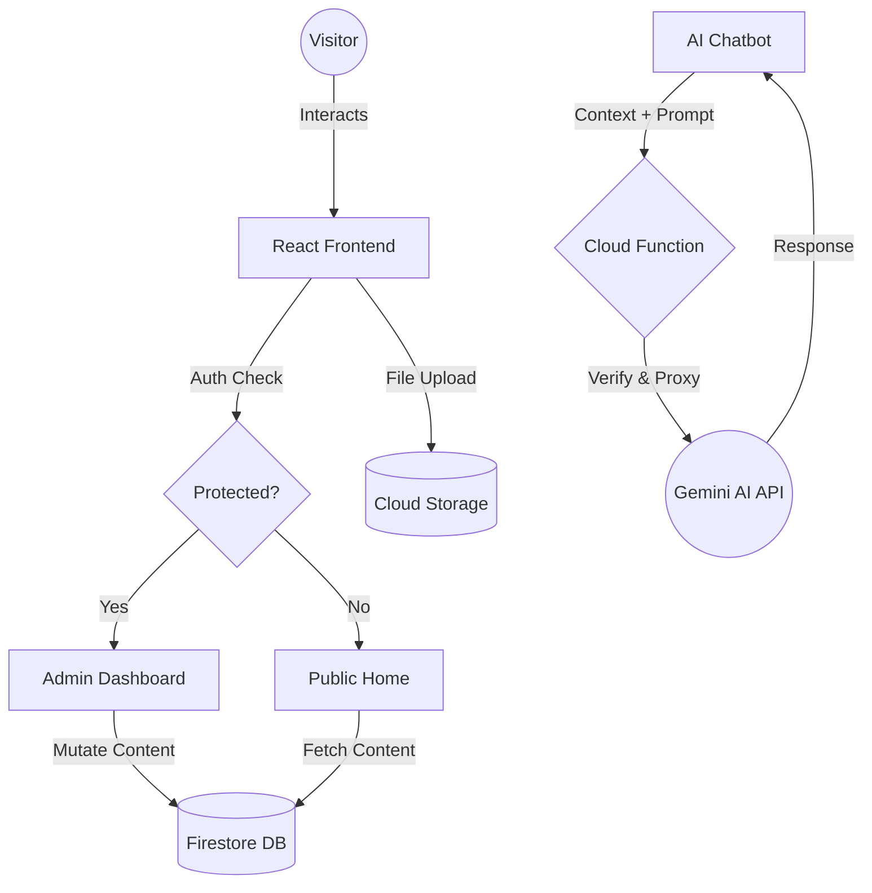

# Aditya Raj Portfolio - Project Documentation & Explanation

## 1. Project Overview
The **Aditya Raj Portfolio** is a high-performance, visually stunning, and feature-rich web application designed to showcase professional work, skills, and personal branding. Built with a focus on **User Experience (UX)** and **Aesthetic Excellence**, it leverages modern technologies like **React 19**, **Vite**, and **Firebase** to provide a seamless, real-time experience.

### Key Highlights:
- **Glassmorphism UI**: A modern, frosted-glass aesthetic across all components.
- **AI-Powered Insights**: An integrated assistant that knows everything about the owner's career.
- **Headless CMS**: A custom-built admin panel for effortless content management.
- **Performance First**: Optimized loading with Vite and smooth animations with Framer Motion.

---

## 2. Core Features Breakdown

### A. Public Portfolio (The Visitor Experience)
The landing page (`Home.jsx`) is the face of the project. It is fully dynamic, hydrationing content from Firestore in real-time.
- **Dynamic Skills Extraction**: Instead of hardcoding skills, the app scans all project tech stacks, deduplicates them, and displays an auto-generated skills grid.
- **Smooth Interaction**: Uses **Lenis** for inertial scrolling and **Framer Motion** for entrance animations.
- **Advanced UI Elements**: Includes a `ParticleBackground`, `TypewriterText` effects, and a `CustomCursor` that reacts to interactive elements.

### B. Admin CMS (The Control Center)
Accessible via `/admin`, this protected dashboard allows the owner to manage the entire site without touching a line of code.
- **Project Management**: CRUD operations for portfolio items, including image and APK uploads.
- **Drag-and-Drop Reordering**: Uses `@dnd-kit` to allow custom sorting of projects, saving positions instantly to Firestore.
- **Analytics Dashboard**: Visualizes visitor statistics and message frequency using **Recharts**.
- **Global Settings**: Manage profile info, resume links, and AI API configurations.

### C. AI Chatbot (The Digital Assistant)
A sophisticated chatbot (`Chatbot.jsx`) that acts as a proxy for Aditya.
- **Context Awareness**: On launch, it fetches a summary of all projects and profile data from Firestore.
- **RAG Implementation**: It feeds this context into the **Gemini 3 Flash** model via Firebase Cloud Functions, ensuring it only talks about Aditya's work.
- **Imperative Control**: Feature components can "talk" to the chatbot (e.g., clicking a "Discuss Project" button opens the chat with a pre-filled prompt).

---

## 3. Technical Architecture

### Frontend Layer
- **Framework**: React 19 (Functional Components & Hooks).
- **Styling**: Tailwind CSS 4.0 for utility-first responsive design.
- **State Management**: React State & Effects (Centralized in `AdminLayout` for CMS).
- **Animations**: Framer Motion & CSS keyframes for complex transitions.

### Backend Infrastructure (Firebase)
- **Authentication**: Firebase Auth manages secure admin sessions.
- **Firestore (NoSQL)**: Stores projects, settings, and visitor logs.
- **Cloud Storage**: Hosts project thumbnails, PDF resumes, and Android APKs.
- **Cloud Functions**: A Node.js environment that securely handles Gemini AI API calls, protecting the secret keys.
- **Hosting**: Deployed on Firebase’s global CDN for sub-second load times.

---

## 4. Logical Data Flow



---

## 5. Security & Best Practices
- **Security Rules**: Firestore and Storage rules ensure that only authenticated admins can write data, while the public can only read what is necessary.
- **API Protection**: No sensitive API keys (like Gemini) are stored in the frontend; they are handled server-side in Cloud Functions.
- **SEO Optimization**: Uses `react-helmet-async` to manage dynamic meta tags and titles for better search engine visibility.

---

## 6. Local Setup & Deployment

### Prerequisites
- Node.js (v18+)
- Firebase Account

### Step 1: Install Dependencies
```bash
npm install
```

### Step 2: Configure Environment
Create a `.env` file with your Firebase credentials:
```env
VITE_FIREBASE_API_KEY=your_key
VITE_FIREBASE_AUTH_DOMAIN=your_domain
...
```

### Step 3: Run Development Server
```bash
npm run dev
```

### Step 4: Deploy to Production
```bash
npm run build
firebase deploy
```

---

## Conclusion
This portfolio is more than a resume—it's a full-stack software product. It combines the latest in web technologies with AI to create a truly interactive and professional digital presence.
